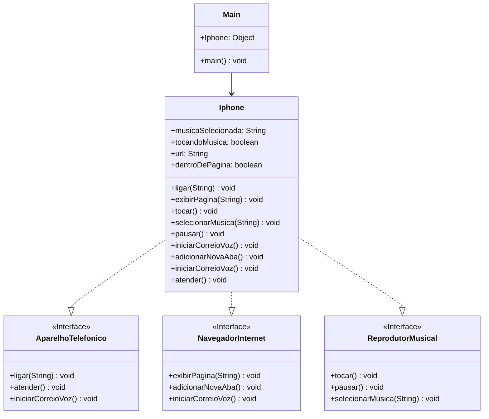

## Modelando um Iphone com UML
Um exemplo de iphone extremamente básico em Java.

# Tecnologias utilizadas

# Como utilizar?

Para iniciar, é necessario possuir o Java instalado, abriremos o terminal na pasta do projeto e executaremos os seguintes passos: 
Abra o terminal na pasta onde foi baixado o projeto. 
Execute no terminal o comando `java Main` -> Para executarmos o arquivo `.class`.  
Caso de erro, tente atualizar sua versão Java para a versão 21, pois foi essa versão utilizada para o desenvolvimento do projeto. 

# UML do código

